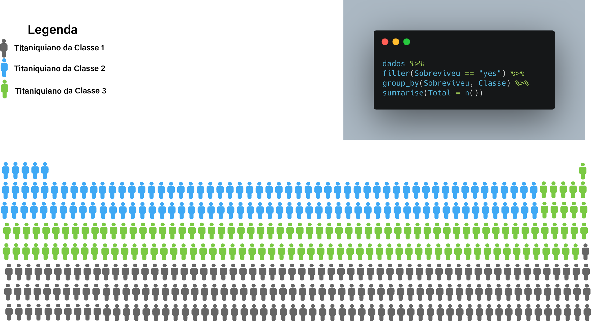

```{r setup, include=FALSE}
options(htmltools.dir.version = FALSE)

### Leitura e Tratamento dos Dados DataSet ###
library(tidyverse)
library(readxl)
library(magrittr)
# Lendo arquivo 
arquivo <- "data/Titanic's Passengers Dataset.xlsx"
# Carregando dados na variável correspondente
dados <- read_excel(arquivo, sheet = "Sheet1")
# Iremos Trabalhar somente com os dados de Classe, Idade, Genero e Sobreviveu
dados %<>% select(Classe, Sobreviveu, Idade, Genero)
# Descartaremos linhas com campos nulos/em branco
dados <- dados[complete.cases(dados),]
# Criando Codigo para Genero. 0 Masculino, 1 Feminino
dados %<>% mutate(Codigo_Sexo = ifelse(Genero == "male",0,1))


### Calculando Estatísticas para visualização abstrata
sample.range <- 1:80
iq_classe1.mean <- 43.25
iq_classe1.sd <- 14.23
iq_classe1.dist <- dnorm(sample.range, mean = iq_classe1.mean, sd = iq_classe1.sd)
iq_classe1.df <- data.frame("Idade" = sample.range, "Densidade" = iq_classe1.dist)
p_classe1_maior50 = sum(iq_classe1.df$Densidade[iq_classe1.df$Idade >= 50])
idade_classe1_percentil95_superior = iq_classe1.mean + 2*iq_classe1.sd
idade_classe1_percentil95_inferior = iq_classe1.mean - 2*iq_classe1.sd

c1_grafico = ggplot(iq_classe1.df, aes(x = Idade, y = Densidade)) + geom_point() + geom_vline(xintercept = c(idade_classe1_percentil95_superior, idade_classe1_percentil95_inferior))

iq_classe2.mean <- 33.18
iq_classe2.sd <- 12.23
iq_classe2.dist <- dnorm(sample.range, mean = iq_classe2.mean, sd = iq_classe2.sd)
iq_classe2.df <- data.frame("Idade" = sample.range, "Densidade" = iq_classe2.dist)
p_classe2_maior50 = sum(iq_classe2.df$Densidade[iq_classe2.df$Idade >= 50])
idade_classe2_percentil95_superior = iq_classe2.mean + 2*iq_classe2.sd
idade_classe2_percentil95_inferior = iq_classe2.mean - 2*iq_classe2.sd

c2_grafico = ggplot(iq_classe2.df, aes(x = Idade, y = Densidade)) + geom_point() + geom_vline(xintercept = c(idade_classe2_percentil95_superior, idade_classe2_percentil95_inferior))

iq_classe3.mean <- 25.97
iq_classe3.sd <- 11.88
iq_classe3.dist <- dnorm(sample.range, mean = iq_classe3.mean, sd = iq_classe3.sd)
iq_classe3.df <- data.frame("Idade" = sample.range, "Densidade" = iq_classe3.dist)
p_classe3_maior50 = sum(iq_classe3.df$Densidade[iq_classe3.df$Idade >= 50])
idade_classe3_percentil95_superior = iq_classe3.mean + 2*iq_classe3.sd
idade_classe3_percentil95_inferior = iq_classe3.mean - 2*iq_classe3.sd

c3_grafico = ggplot(iq_classe3.df, aes(x = Idade, y = Densidade)) + geom_point() + geom_vline(xintercept = c(idade_classe3_percentil95_superior, idade_classe3_percentil95_inferior))


```

```{r xaringan-themer, include=FALSE, warning=FALSE}
library(xaringanthemer)
style_duo_accent(
  primary_color = "#1381B0",
  secondary_color = "#FF961C",
  inverse_header_color = "#FFFFFF"
)
```
class: inverse, center, middle

# Quão longeva foi a vida dos habitantes da Titanicolândia (!) antes de seu fatídico fim?

---
class: center, middle

# Preparando os Dados

```{r fig2, fig.cap='Limpeza e Tratamento de Dados', echo=FALSE, message=FALSE, warning=FALSE}

```

---
class: inverse, center, middle

# Parte 1: Contextualização
___


---
class: center, middle

# Qual era Expectativa de vida nos Estados Unidos em 1912?

```{r fig1, fig.cap='Expectativa de Vida nos USA', echo=FALSE, message=FALSE, warning=FALSE}

```

---

# Informações Relevantes

Qual o tamanho da população que estamos avaliando?

```{r eval=TRUE, tidy=FALSE}
nrow(dados)
```


Quantos Sobreviveram e Quantos Morreram?
```{r eval=TRUE, tidy=FALSE, results='asis'}
knitr::kable(dados %>% 
               group_by(Sobreviveu) %>% 
               summarise(Total = n()), 
             format = 'html') 
```

---

# Informações dos Mortos

Dados de Idade Média, Desvio Padrão (dp) e Valor médio do sexo

```{r eval=TRUE, tidy=FALSE, results='asis'}
knitr::kable(dados %>% 
               filter(Sobreviveu == "no") %>% 
               group_by(Classe) %>% 
               summarise(media_idade = mean(Idade), dp = sd(Idade), 
                         media_sexo = mean(Codigo_Sexo) ), 
             format = 'html') 
```

Valores da variável media_sexo mais próximos de zero indicam forte prevalência de indíviduos do sexo masculino. 

---

# Informações - Classe 1

```{r fig10, fig.cap='Distribuição de Probabilidade da Idade dos Titaniquianos da Classe 1 que não sobreviveram', echo=FALSE, message=FALSE, warning=FALSE}

```

---

# Informações - Classe 2

```{r fig11, fig.cap='Distribuição de Probabilidade da Idade dos Titaniquianos da Classe 2 que não sobreviveram', echo=FALSE, message=FALSE, warning=FALSE}

```

---

# Informações - Classe 3

```{r fig12, fig.cap='Distribuição de Probabilidade da Idade dos Titaniquianos da Classe 3 que não sobreviveram', echo=FALSE, message=FALSE, warning=FALSE}

```


---
class: inverse, center, middle

# Parte 2: Visualização
___

### Figurativa

---

# Quem Sobreviveu?

181 Titaniquianos 'Classe 1', 115 'Classe 2' e 131 'Classe 3'. Aí estão eles:

```{r fig3, fig.cap='', echo=FALSE, message=FALSE, warning=FALSE}

```
---
# Quem Não Sobreviveu?

103 Titaniquianos 'Classe 1', 146 'Classe 2' e __370__ 'Classe 3'. Aí estão eles:

```{r fig4, fig.cap='', echo=FALSE, message=FALSE, warning=FALSE}

```
---
class: inverse, center, middle

# Parte 3: Visualização
___

### Abstrata

---

# Como funciona?

```{r fig5, fig.cap='', echo=FALSE, message=FALSE, warning=FALSE}

```


---

# Classe 1

```{r fig6, fig.cap='', echo=FALSE, message=FALSE, warning=FALSE, out.width='50%'}

```


---

# Classe 2

```{r fig7, fig.cap='', echo=FALSE, message=FALSE, warning=FALSE, out.width='50%'}

```


---

# Classe 3

```{r fig8, fig.cap='', echo=FALSE, message=FALSE, warning=FALSE, out.width='50%'}

```


---
class: center, middle

# Fim!

Limpeza, Tratamento e Estatísticas dos dados usando [**R 4.0**](https://www.r-project.org/)

Slides criados através do pacote R [**xaringan**](https://github.com/yihui/xaringan) com a ajuda de [**remark.js**](https://remarkjs.com), [**knitr**](http://yihui.name/knitr), e [**R Markdown**](https://rmarkdown.rstudio.com).

A imagem do Girassol foi obtida, de forma gratuita, através do site [Sunflower Vectors by Vecteezy](https://www.vecteezy.com/free-vector/sunflower)

Os demais ícones fazem parte da biblioteca de elementos infográficos disponíveis após instalação do [Software Adobe Illustrator](https://www.adobe.com/br/products/illustrator.html).
